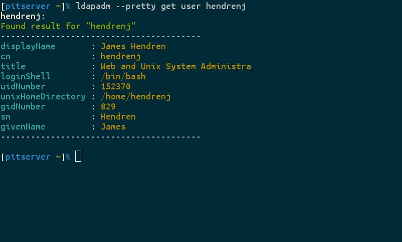

# ldapadm

A command-line tool for performing common administrative tasks on an
LDAP server, such as retrieving information about objects, creating and
deleting objects, and adding and removing objects from group membership.

## Requirements

* Python 2.7
* [python-ldap](http://www.python-ldap.org/)
* [pyyaml](http://pyyaml.org/)

For development purposes only:

* [mock](http://mock.readthedocs.org/en/latest/)
* (optional) [watchdog](http://pythonhosted.org/watchdog/)

## Usage

ldapadm commands are typically run with the following syntax:

    $ ldapadm --flags command object_type object_name

where:

* `command` is one of:

  * **`get`** - to fetch a single object and view its attributes
  * **`search`** - to run a search against the LDAP server and view the
    attributes of all returned objects
  * **`create`** - to create a new object using a user-supplied schema
  * **`delete`** - to delete an existing object
  * **`insert`** - to insert an object into group membership
  * **`remove`** - to remove an object from group membership

* `object_type` is one of the object types supplied by the user via
  configuration
* `object_name` is the name of the object being acted upon.

To see all available flags and options, run `ldapadm -h` or `ldapadm
--help`.  For more specific help on a particular command, run `ldapadm
command -h` or `ldapadm command --help`.

## Output

To improve inter-process operability, ldapadm generates YAML-formatted
output.  The following object structure is used for the output of all
commands (in pseudo-YAML format):

    query1:
      success: true|false
      message: "a simple message about the result of the command"
      results:
        - - "distinguished name of the first object"
          - attribute1: ["value1", "value2", ... ]
          - attribute2: ["value3", ...]
          - attribute_with_no_value: null
        - - "distinguished name of the second object"
          - ...
        ...
    query2:
      ...
    ...

* Each key in the top-level object is one of the arguments to the command.
  For instance, in the command `ldapadm get user alice bob carol`, the
  keys will be `alice`, `bob`, and `carol`.  For the command `ldapadm
  insert group hackers user dave edgar felicia`, the keys will be `dave`,
  `edgar`, and `felicia`.
* The value for each key is another object.  This object will always
  have the key `success`, which is a boolean (`true` or `false`) value
  indicating whether the requested operation completed successfully.
  `message` contains diagnostic information.  The `results` key deserves
  its own bullet point:
* `results` does not exist in the output of all commands.  Only commands
  that return LDAP objects, specifically the `get` and `search` commands,
  will populate `results`.  `results` will always be a list (in the case
  of the `get` command, this list is guaranteed to be of length 1).
  Each object in the list is an LDAP object, which is itself a list
  containing two values: the first value is the distinguished name ("dn") of
  the object, and the second value is a mapping of the object's attributes.
  The value for each attribute is always either a list or the value "null"
  (the value "null" occurs when the user requests to display an attribute
  via configuration, but that attribute does not exist on the object).
  Each value in the list is a string.

You can also choose to make the output more colorful and easy-to-read
(but break machine-readability) by using the `-r` or `--pretty` flag:

## Configuration

The heart of the ldapadm tool is configuration.  Although ldapadm doesn't
offer any more functionality than OpenLDAP command-line client tools
(for instance), once ldapadm is properly configured, the user need not
know anything about LDAP schemas or the LDAP protocol.

Configuration must be in YAML format.  Configuration can be stored
in a file or supplied on the command line.  The default path for the
configuration file is (TBA; not implemented).  The configuration file path
can be changed using the `-c` or `--config` option at the command line.
See below for how to supply configuration directly on the command line
using the `-o` or `--options` flag.

Here are the available configuration options (note that, as of this
writing, this tool is not yet complete and not all configuration items
are implemented):

    uri:             # uri of the ldap server. required
    options:         # dictionary of ldap options
    <type>:            # user-supplied type; configuration may define an
                     # arbitrary number of types. at least one is required
      base:          # search base. required
      scope:         # search scope [base, onelevel, subtree] default: subtree
      member:        # attribute that contains member DNs.
                     # used when adding/removing membership. default: member
      member_oid:    # Active Directory OID to add to member query
      member_of:     # attribute that contains membership DNs.
                     # used when searching membership. default: memberOf
      member_of_oid: # Active Directory OID to add to member_of query
      schema:        # schema for new objects
      identifier:    # attribute to look in for "get" commands. default: cn
      search:        # attributes to look in for "search" commands.
                     # default: [cn, sn]
      filter:        # apply this search filter when querying for objects
      display:       # attributes to display when retrieving users/groups.
                     # if not given, all attributes will be printed

Some notes:

* `options`: A mapping of options and their values that are passed
  directly on to the python-ldap library.  For instance:

  * `OPT_REFERRALS: 0`
  * `OPT_X_TLS_CACERTDIR: /usr/local/openssl/certs`

  More information on the options is available in the [python-ldap
  documentation](http://www.python-ldap.org/doc/html/ldap.html#options).
  Note that all options start with `OPT_`.
* `type`: These values will be referenced by the `object_type` argument
  for each ldapadm command.  For instance, if you wish to be able to
  run the commands `ldapadm get user ...` and `ldapadm get group ...`,
  you must define the types `user` and `group` in your configuration.
* `member_oid` and `member_of_oid`: This is Active Directory-specific and may
  break other server types.  See the [MSDN documentation]
  (https://msdn.microsoft.com/en-us/library/aa746475%28v=vs.85%29.aspx) for
  more info.
* `identifier`: Typically, the identifier attribute (usually "cn")
  plus the base can be combined to create the distinguished name for the
  object, but if you wish to reference objects by names other than their
  cn, you may set this option to a different attribute.
* `schema`: Used only when creating new objects.  The schema must be
  a mapping of attributes to their values for the new object.  The best
  way to use this option is to configure the common values that should
  be set for all new objects of this type, and then use command-line
  configuration options to add additional values that need to be unique
  for each new object.  A couple more notes:

  * values in the schema must be in a list.  For instance:
    `cn: [first name]`, `sn: [last name]`
  * attributes must be strings.  This means uids and gids must be
    quoted to avoid being interpreted by the YAML parser as numbers.
    For instance: `uidNumber: ['12345']`, `gidNumber: ['12345']`

* `search`: A list of attributes that will be searched when running
  the `search` command.  Note that a wildcard will be added after each
  search argument, so a search may not return an exact attribute match.
  Wildcards are not added before the search arguments, as this causes
  queries to hang or return a "too many results" error on most LDAP servers.
* `filter`: This is an ldap search filter that will be applied to all
  lookups, which means that it will affect not only results from `get`
  and `search` commands, but also the objects acted upon in `insert` and
  `remove` commands.
* `display`: The attributes to display in the output of the `get` and `search`
  commands.  If this option is absent or `null`, all attributes will be
  returned.  If an attribute is listed in this option but not present on
  an object, the value for that attribute will be `null` in the output.

An example configuration file can be found in the [Examples](#Examples) section.

Configuration can also be supplied on the command line with an argument
to the `-o` or `--options` flag.  The argument must be a YAML-formatted
string with the same structure as above.  Any configuration options
supplied this way will merge with and override options supplied in the
configuration file.

Examples of using the `-o` flag are available in the [Examples](#Examples) section.

## Examples

*More examples coming soon.*

Here are a couple examples of configuration supplied using the `-o` flag:

* `ldapadm -o "uri: 'ldaps://foo.bar'" get user foobar`
* `ldapadm -o "{user: {schema: {cn: ['john'], sn: ['doe']}}}" create
   user johndoe`
